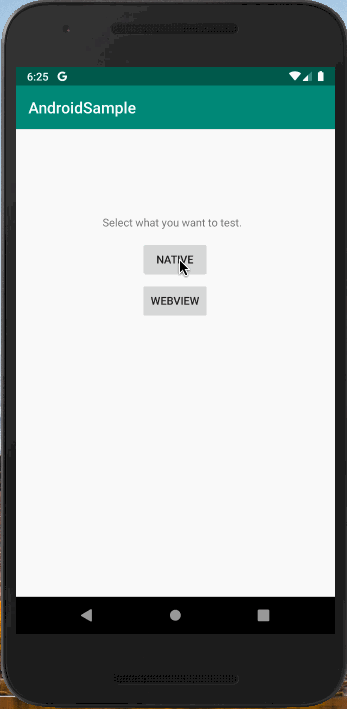
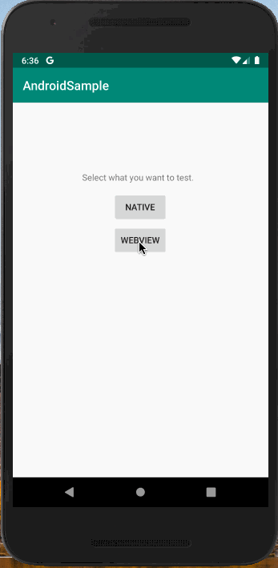
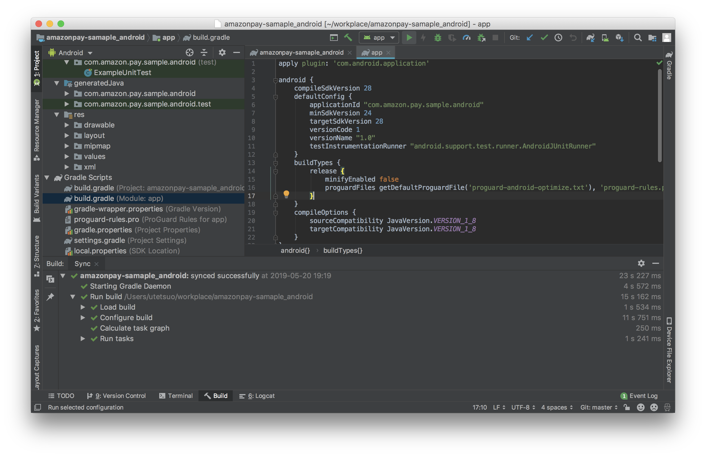
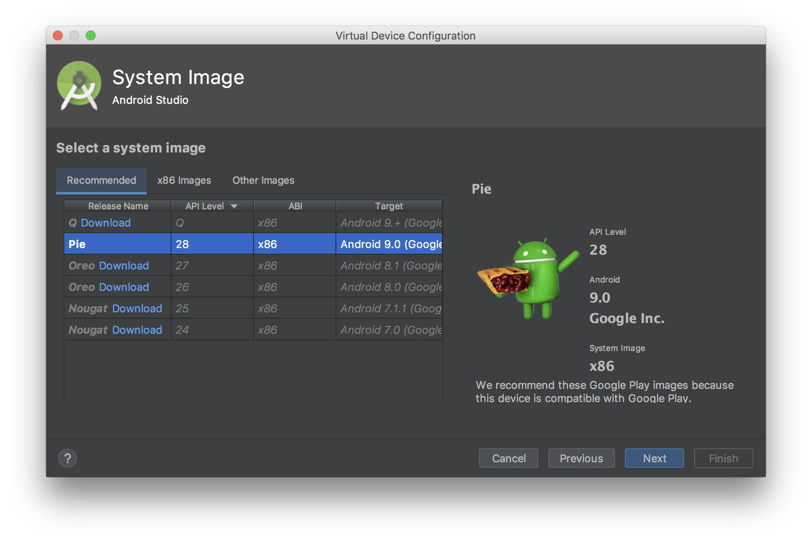
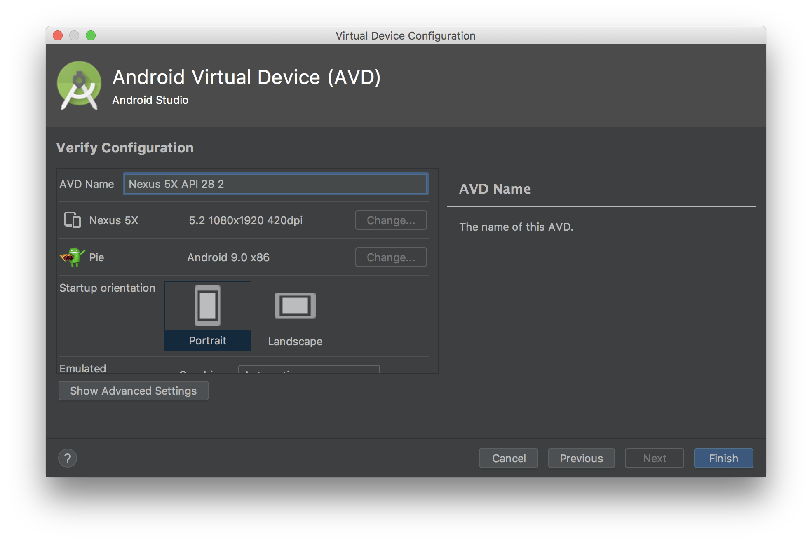
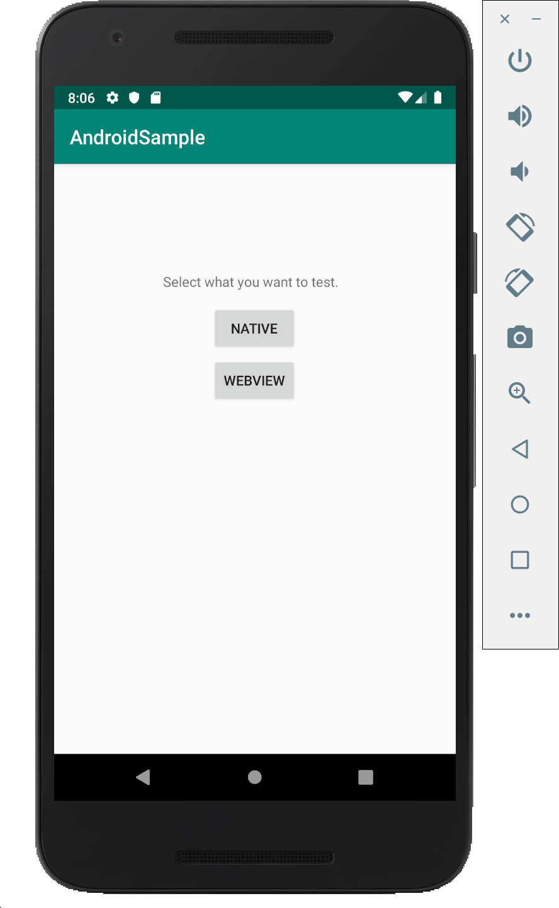
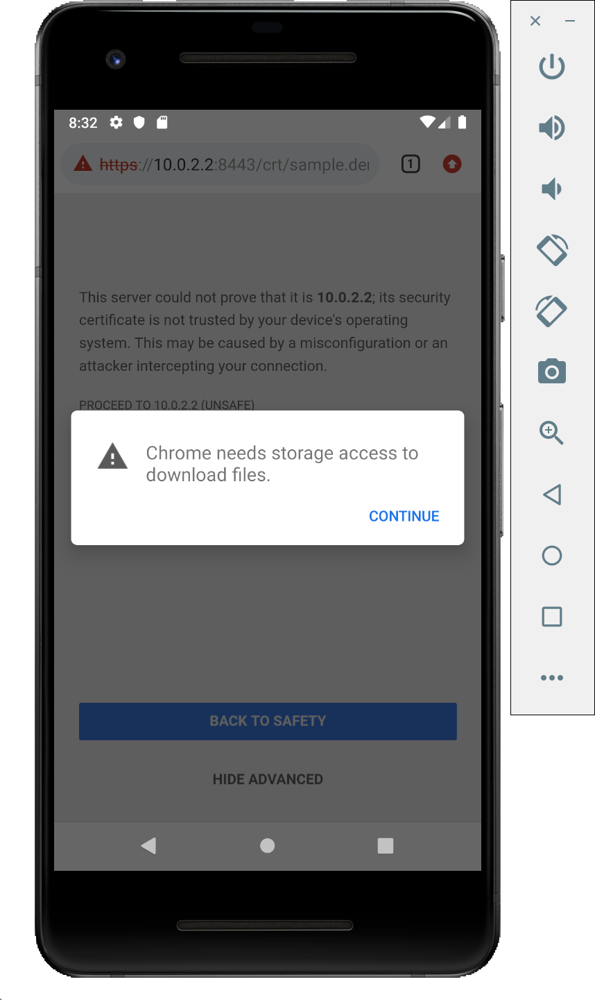
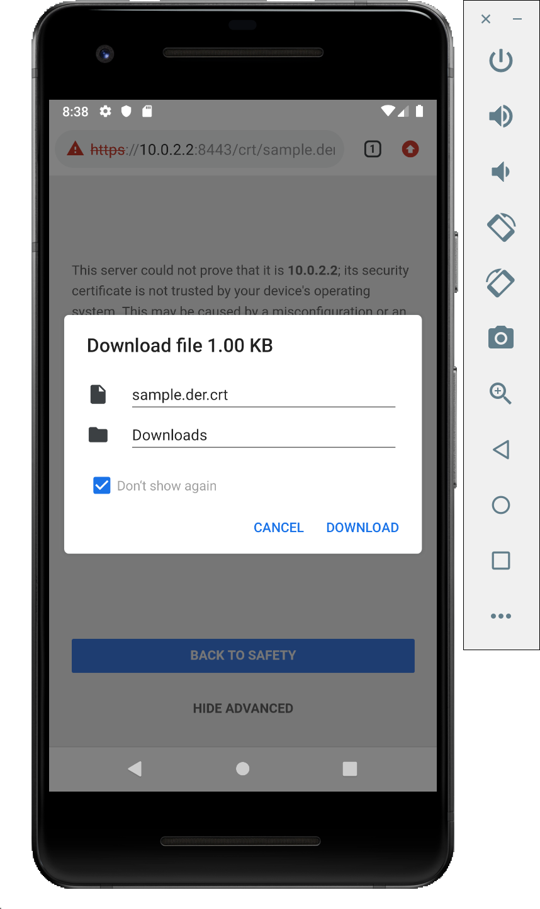
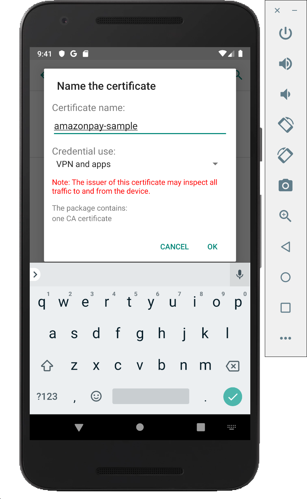

# Amazon Pay モバイル サンプルアプリについて
SmartPhone上でAmazon Payを使って商品を購入するアプリの、サンプル実装を提供しています。  
技術的には、Amazon Payボタン・住所選択ウィジェット・支払い方法選択ウィジェットなどの画面部品をアプリから起動したブラウザ上で表示して決済を行なっており、決済部分はHTML + CSS + JavaScriptで実装されています。  
通常のPC上での実装とほぼ同じ方式で決済が実現できるため、学習コストの節約・コードのメンテナンスビリティの向上といった効果が見込めます。  
現時点ではAndroid向けの実装のみ、下記の２種類提供しています。  

## Android Native版
通常のAndroidアプリ向けの実装サンプルです。  
アプリ側で商品の購入数を選んで受注情報を作成し、Chrome Custom Tabsを起動してAmazon Payへのログイン・住所＆支払い方法の選択・購入を実施し、またアプリ側に戻って購入完了画面を表示します。  

### 動作環境
Android 7以降: Google Chrome 64以降  
[参考] https://pay.amazon.com/jp/help/202030010

### 画面動作


### 詳細フロー
./flow.xlsx の「Native」タブ参照。  
※ 同flowには各処理のURL, 処理するClass名、HTMLテンプレート名なども記載されているので、サンプルコードを読む時にもご参照ください。

## Android WebView版
WebView(アプリ内ブラウザ)を使ったアプリ向けの実装サンプルです。  
基本的な流ればNative版と同じで、WebView内で商品の購入数を選んで受注情報を作成し、Chrome Custom Tabsを起動してAmazon Payへのログイン・住所＆支払い方法の選択・購入を実施し、またアプリ側に戻って購入完了画面を表示します。  

### 動作環境
Android 7以降: Google Chrome 64以降  
[参考] https://pay.amazon.com/jp/help/202030010

### 画面動作


### 詳細フロー
./flow.xlsx の「WebView」タブ参照。  
※ 同flowには各処理のURL, 処理するClass名、HTMLテンプレート名なども記載されているので、サンプルコードを読む時にもご参照ください。

# インストール

## clone the projects
まずは、server側のbackendにあたる本プロジェクトをcloneしてください。  
`
git clone https://github.com/tauty/amazonpay-mobile-sample_server.git
`

そして、client側にあたるAndroidのプロジェクトもcloneしてください。  
`
git clone https://github.com/tauty/amazonpay-mobile-sample_android.git
`

## open the projects
cloneしてきたプロジェクトは、それぞれserver側が[Intellij IDEA Community(無料)](https://www.jetbrains.com/idea/download/)、Android側が[Android Studio(無料)](https://developer.android.com/studio/)で作成されています。そのほかのIDEでも開くことはできますが、ここではそれぞれ上記のIDEでの開き方を説明します。  
これらのIDEをまだインストールされていない方は、上記のリンク先よりダウンロードしてインストールするか、パッケージマネージャの利用が可能ならそちらからインストールするかしてください。

### open the server project & start
server側のプロジェクトは、Intellij IDEAで開きます。
まずはIntellijを立ち上げます。  
*※ 下記の画面になっていない場合は、Intellijで開いているプロジェクトを全て閉じてください。*  

「Import Project」 → cloneしたプロジェクトを選択 → 「Open」 → 「Import project from external model」「Gradle」を選んで、「Next」 →　「Finish」  
プロジェクトが開いてGradleのbuildが始まりますので、終わるまで数分お待ちください。  

#### register new application and cofigure its redirect URL via seller central
[Seller Central](https://sellercentral.amazon.co.jp/)にて、本サンプル用に新しいアプリケーションを登録します。
登録したアプリケーションのウェブ設定より、JavaScriptの種類とリダイレクトURLを下記のように設定します。
- JavaScriptの種類
  - https://localhost:8443
  - https://10.0.2.2:8443
- リダイレクトURL
  - https://localhost:8443/confirm_order
  - https://10.0.2.2:8443/confirm_order

Note: IPアドレスの「10.0.2.2」とは、PCと接続したAndroidデバイス＆Android EmulatorからPCの「localhost」環境にアクセスするための特殊なアドレスです。

#### configure merchant.properties
クライアントID、出品者ID、アクセスキーID、シークレットアクセスキーを、merchant.propertiesファイルに設定します。  
merchant.propertiesは「./src/main/resources」の下に置く必要がありますが、この時点ではまだ配置されていません。  
プロジェクトのroot directory直下に雛形の「merchant.properties」が置いてあるので、こちらを上記「./src/main/resources」の下にコピーします。  
コピーしたファイルを開くと、中は下記のようになっています。
```
client.id=amzn1.application-xxx-xxxxxx.xxxxxxxxxxxxxxxxxxxxxxxxxxxxxxxx
seller.id=XXXXXXXXXXXXXX
access.key=XXXXXXXXXXXXXXXXXXXX
secret.key=XXXXXXXXXXXXXXXXXXXXXXXXXXXXXXXXXXXXXXXX
```
ご自身の保有する[Seller Central](https://sellercentral.amazon.co.jp/)のアカウントのページより、上記それぞれのクライアントID、出品者ID、アクセスキーID、シークレットアクセスキーを入力して、保存してください。  
なお、ここで編集した「./src/main/resources/merchant.properties」は、「.gitignore」という仕組みを用いてgitには登録されないよう設定されています。よってこちらはcommitもpushもされませんので、入力した内容が漏洩することはありません。

#### bootRun
Gradle Viewを開いて「Tasks」 →　「application」 →　「bootRun」より起動してください。  
※ Gradle Viewが表示されていない場合は、メニューの「View」→「Tool Window」→「Gradle View」からOpenしてください。


下記のようなログが表示されれば無事に起動しています。  


試しに、https://localhost:8443/order.html にアクセスしてみてください。セキュリティの警告が出ますが、無視して進めると下記画面が表示されるはずです。  


### open the android project & start
clinentのandroid側のプロジェクトは、Android Studioで開きます。
Android StudioはIntellijをベースに開発されていますので、基本的な流れはserver側とほぼ同様です。
まずはAndroid Studioを立ち上げます。  
*※ 下記の画面になっていない場合は、Android Studioで開いているプロジェクトを全て閉じてください。*  

「Import Project」 → cloneしたプロジェクトを選択 → 「Open」  
プロジェクトが開いてGradleのbuildが始まりますので、終わるまで数分お待ちください。  
終了したら、Menuの「Run」→「Run app」か、画面上部の「Run app」ボタンより、applicationを起動してください。

下記のようなapplicationを実行するAndroidデバイス or Virtual Device(Emulatorで起動される、仮想的なAndroidデバイス)を選択する画面が開きます。今回はEmulatorでの起動方法を説明します。  
「Create New Virtual Device」をクリックします。  

今回のサンプルはSDK28で作成されていますので、それ以上のVersionのVirtual Deviceがあればそちらを選択します。
そうでなければ、ここで「Create New Virtual Device」をクリックして、Virtual Deviceを作成します。  

左側の「Category」で「Phone」を選択し、開発に用いたい端末を選択します。  
*※特にこだわりがなければ、デフォルトで選択されているもので構いません。*  
「Next」をクリックします。

API Level 28の「Pie」を選んで、「Next」。  
*※まだDownloadされていない場合には、「Download」より、画面の指示に従ってDownloadしてください。*

「Finish」でVirtual Deviceの生成が開始されますので、数分お待ちください。  
生成が完了すると、生成されたVirtual Deviceが選択できるようになるので、こちらを選択して「OK」。

Emulatorが立ち上がり、サンプルアプリが起動します。(1〜2分かかります。)  


#### install SSL self-certification
今回のサンプルでは、server側のSSL証明書に自己証明書が使用されているため、サンプルアプリを正しく動作させるためにはその自己証明書をAndroid側にInstallする必要があります。  
ここでは、Emulatorで起動したVirtual DeviceへのInstall方法を説明します。

1. PIN lockの設定  
Androidではセキュリティのため、PINを設定しないとSSL証明書をInstallできません。  
設定画面を開き、セキュリティの設定より「画面のロック(Screen lock)」よりPINを設定してください。  
*※設定画面の開き方や各種設定は、端末やOSのバージョンによっても変わりますので、もし分からなければGoogleなどで検索してお調べください。  
参考までに、代表的な設定画面の開き方としては、アプリ一覧アイコンをクリックして選択する、ホーム画面で下からスワイプしてアプリ一覧を出して選択する、などがあります。*  
  

2. SSL自己証明書のDownload & Install  
Chromeを立ち上げ、下記のURLにアクセスします。  
https://10.0.2.2:8443/crt/sample.der.crt  
下記のように警告が出るので、「ADVANCED」→「PROCEED TO 10.0.2.2(UNSAFE)」  
  
「CONTINUE」  
  
「ALLOW」  
  
「DOWNLOAD」  
  
PINを聞かれるので、先ほど設定した値を入力します。  
表示された証明書Install画面にて、名前の欄に適当な名前を入力し、「VPN and apps」が選択されていることを確認して、「OK」をクリックすればインストール完了です。  
  

あとはEmulator上でサンプルアプリを立ち上げて動作をご確認ください。
AndroidのNativeのアプリからAmazonPayで購入するサンプルと、WebViewからAmazonPayで購入するサンプルの、両方の動作をご確認いただけます。
