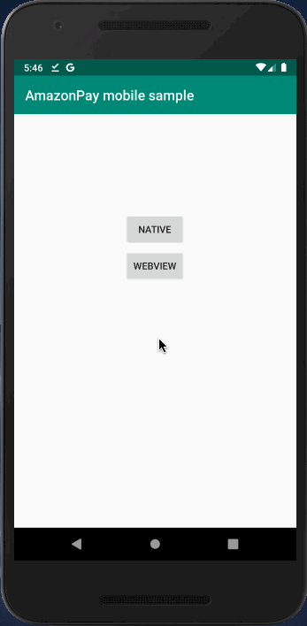
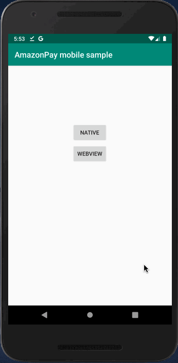
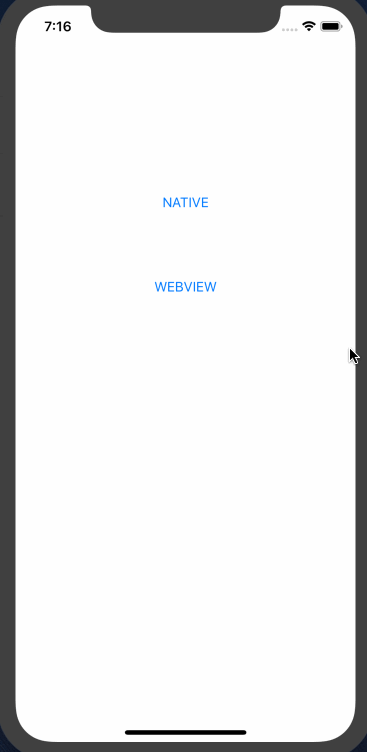
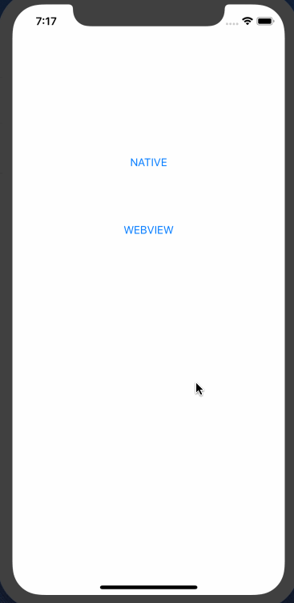

# Amazon Pay モバイル サンプルアプリについて
SmartPhone上でAmazon Payを使って商品を購入するアプリの、サンプル実装を提供しています。  
技術的には、Amazon Payボタン・住所選択ウィジェット・支払い方法選択ウィジェットなどの画面部品をアプリから起動したブラウザ上で表示して決済を行なっており、決済部分はHTML + CSS + JavaScriptで実装されています。  
通常のPC上での実装とほぼ同じ方式で決済が実現できるため、学習コストの節約・コードのメンテナンスビリティの向上といった効果が見込めます。  

サーバー用の本プロジェクトの他に、Androidアプリ・iOS(iPhone, iPad)アプリ用の二つを合わせた、合計３つのプロジェクトで構成されており、それぞれのURLは下記になります。
- Server: https://github.com/tauty/amazonpay-mobile-sample_server
- Android: https://github.com/tauty/amazonpay-mobile-sample_android
- iOS(iPhone, iPad): https://github.com/tauty/amazonpay-mobile-sample_ios

Android版・iOS版について、下記に概要を示します。

## Android
### Native版
通常のAndroidアプリ向けの実装サンプルです。  
アプリ側で商品の購入数を選んで受注情報を作成し、Chrome Custom Tabsを起動してAmazon Payへのログイン・住所＆支払い方法の選択・購入を実施し、またアプリ側に戻って購入完了画面を表示します。  

#### 動作環境
Android 7以降: Google Chrome 64以降  
[参考] https://pay.amazon.com/jp/help/202030010

#### 画面動作


### WebView版
WebView(アプリ内ブラウザ)を使ったアプリ向けの実装サンプルです。  
基本的な流ればNative版と同じで、WebView内で商品の購入数を選んで受注情報を作成し、Chrome Custom Tabsを起動してAmazon Payへのログイン・住所＆支払い方法の選択・購入を実施し、またアプリ側に戻って購入完了画面を表示します。  
※ Amazon Payではセキュリティ確保のため、URLを隠したり偽装したりできてしまうWebView上でのログイン処理を原則禁止しております。そのため、本サンプルのようにChrome Custom Tabsへ処理を飛ばす必要があります。

#### 動作環境
Android 7以降: Google Chrome 64以降  
[参考] https://pay.amazon.com/jp/help/202030010

#### 画面動作


## iOS(iPhone, iPad)
### Native版
通常のiOSアプリ向けの実装サンプルです。  
アプリ側で商品の購入数を選んで受注情報を作成し、SFSafariViewを起動してAmazon Payへのログイン・住所＆支払い方法の選択・購入を実施し、またアプリ側に戻って購入完了画面を表示します。  

#### 動作環境
iOS バージョン11.2以降: Safari Mobile 11以降  
[参考] https://pay.amazon.com/jp/help/202030010

#### 画面動作


### WebView版
WebView(アプリ内ブラウザ)を使ったアプリ向けの実装サンプルです。  
基本的な流ればNative版と同じで、WebView内で商品の購入数を選んで受注情報を作成し、SFSafariViewを起動してAmazon Payへのログイン・住所＆支払い方法の選択・購入を実施し、またアプリ側に戻って購入完了画面を表示します。  
※ Amazon Payではセキュリティ確保のため、URLを隠したり偽装したりできてしまうWebView上でのログイン処理を原則禁止しております。そのため、本サンプルのようにSFSafariViewへ処理を飛ばす必要があります。

#### 動作環境
iOS バージョン11.2以降: Safari Mobile 11以降  
[参考] https://pay.amazon.com/jp/help/202030010

#### 画面動作


# server側のインストール

## プロジェクトのclone
まずは、server側のbackendにあたる本プロジェクトをcloneしてください。  
```
git clone https://github.com/tauty/amazonpay-mobile-sample_server.git
```

## プロジェクトのopen
cloneしてきたプロジェクトは、[Intellij IDEA Community(無料)](https://www.jetbrains.com/idea/download/)で作成されています。そのほかのIDEでも開くことはできますが、ここでは上記のIDEでの開き方を説明します。  
Intellijをまだインストールされていない方は、上記のリンク先よりダウンロードしてインストールするか、パッケージマネージャの利用が可能ならそちらからインストールするかしてください。

インストールしたら、まずはIntellijを立ち上げます。  
*※ 下記の画面になっていない場合は、Intellijで開いているプロジェクトを全て閉じてください。*  

「Import Project」 → cloneしたプロジェクトを選択 → 「Open」 → 「Import project from external model」「Gradle」を選んで、「Next」 →　「Finish」  
プロジェクトが開いてGradleのbuildが始まりますので、終わるまで数分お待ちください。  

## Seller Centralへの新しいアプリケーション作成とリダイレクトURLの登録
[Seller Central](https://sellercentral.amazon.co.jp/)にて、本サンプル用に新しいアプリケーションを登録します。
登録したアプリケーションのウェブ設定より、JavaScriptの種類とリダイレクトURLを下記のように設定します。
- JavaScriptの種類
  - https://localhost:8443
  - https://10.0.2.2:8443
- リダイレクトURL
  - https://localhost:8443/confirm_order
  - https://10.0.2.2:8443/confirm_order

Note: IPアドレスの「10.0.2.2」とは、PCと接続したAndroidデバイス＆Android EmulatorからPCの「localhost」環境にアクセスするための特殊なアドレスです。

## merchant.propertiesの設定
クライアントID、出品者ID、アクセスキーID、シークレットアクセスキーを、merchant.propertiesファイルに設定します。  
merchant.propertiesは「./src/main/resources」の下に置く必要がありますが、この時点ではまだ配置されていません。  
プロジェクトのroot directory直下に雛形の「merchant.properties」が置いてあるので、こちらを上記「./src/main/resources」の下にコピーします。  
コピーしたファイルを開くと、中は下記のようになっています。
```
client.id=amzn1.application-xxx-xxxxxx.xxxxxxxxxxxxxxxxxxxxxxxxxxxxxxxx
seller.id=XXXXXXXXXXXXXX
access.key=XXXXXXXXXXXXXXXXXXXX
secret.key=XXXXXXXXXXXXXXXXXXXXXXXXXXXXXXXXXXXXXXXX
```
ご自身の保有する[Seller Central](https://sellercentral.amazon.co.jp/)のアカウントのページより、上記それぞれのクライアントID、出品者ID、アクセスキーID、シークレットアクセスキーを入力して、保存してください。  
なお、ここで編集した「./src/main/resources/merchant.properties」は、「.gitignore」という仕組みを用いてgitには登録されないよう設定されています。よってこちらはcommitもpushもされませんので、入力した内容が漏洩することはありません。

## bootRunによるserverの起動
Gradle Viewを開いて「Tasks」 →　「application」 →　「bootRun」より起動してください。  
※ Gradle Viewが表示されていない場合は、メニューの「View」→「Tool Window」→「Gradle View」からOpenしてください。


下記のようなログが表示されれば無事に起動しています。  


試しに、https://localhost:8443/order.html にアクセスしてみてください。セキュリティの警告が出ますが、無視して進めると下記画面が表示されるはずです。  


なお、本サンプルアプリはPC上のブラウザでも動作しますので、アプリの動作の確認や挙動の理解にご活用ください。

*Note: Android & iOSについては、それぞれのプロジェクトのREADME.mdを参照してください。*
