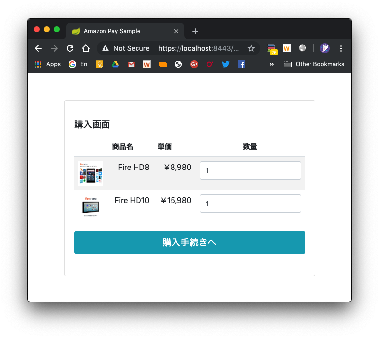

# Amazon Pay モバイル サンプルアプリについて
SmartPhone上でAmazon Payを使って商品を購入するアプリの、サンプル実装を提供しています。  
技術的には、Amazon Payボタン・住所選択ウィジェット・支払い方法選択ウィジェットなどをアプリから起動したアプリ専用の外部ブラウザ(Android:Chrome Custom Tabs, iOS:SFSafariView)上で表示し、Amazon Payへのログイン・ユーザ情報等の取得を行なっており、主にHTML + CSS + JavaScriptで実装されています。  
通常のPC上での実装とほぼ同じ方式でAmazon Pay決済が実現できるため、学習コストの節約・コードのメンテナンスビリティの向上といった効果が見込めます。  

サーバー用の本プロジェクトの他に、Androidアプリ・iOS(iPhone, iPad)アプリ用の二つを合わせた、合計３つのプロジェクトで構成されており、それぞれのURLは下記になります。
- Server: https://github.com/tauty/amazonpay-mobile-sample_server
- Android: https://github.com/tauty/amazonpay-mobile-sample_android
- iOS(iPhone, iPad): https://github.com/tauty/amazonpay-mobile-sample_ios

※ SmartPhoneのアプリで利用できるブラウザ技術としてはWebViewもありますが、こちらはセキュリティ上の問題によりAmazon Payは動作保証をしておりません。よってWebViewで実装されているアプリの場合も、本サンプルを参考にChrome Custom Tabs・SFSafariViewを起動してAmazon Payを使う必要があります。

## 動作環境
Android 7以降: Google Chrome 64以降  
iOS バージョン11.2以降: Safari Mobile 11以降  
[参考] https://pay.amazon.com/jp/help/202030010

## 概要
本サンプルアプリでは、下記それぞれのタイプのアプリ向けの実装を提供しています。  
どの実装も、上記の通りアプリ専用の外部ブラウザを起動して、Amazon Payへのログイン・ユーザ情報の取得などを行っております。  

- Android
  - Nativeアプリ(通常の、Javaなどで作成されたアプリ)
  - WebViewアプリ(アプリ内のブラウザのWebViewを使って実装されたアプリ)
- iOS
  - Nativeアプリ(通常の、Swiftなどで作成されたアプリ)
  - WebViewアプリ(アプリ内のブラウザのWKWewbView or UIWebViewを使って実装されたアプリ)

また、アプリへインテグレーションする時のフローも下記の二通りが用意されています。現在のアプリの実装に合わせて、それぞれ参考にする実装をご選択下さい。

### アプリ側に購入ボタンがあるフロー
アプリ側で商品の購入数を選んで受注情報を作成し、ブラウザを起動してAmazon Payへのログインしてデフォルトの住所＆支払い方法を取得し、アプリに戻って確認画面を表示して購入を実施します。  

  
※ AndroidのNative実装  

住所・支払い方法を変更したい場合には確認画面で「送付先・支払い変更」ボタンをクリックして再度ブラウザを立ち上げて選択します。

  
※ iOSのNative実装  

### 起動したブラウザ側に購入ボタンがあるフロー
アプリ側で商品の購入数を選んで受注情報を作成し、ブラウザを起動してAmazon Payへのログイン・住所＆支払い方法の選択・購入を実施し、またアプリ側に戻って購入完了画面を表示します。  
  
※ iOSのWebView実装  

### 二つのフローの選択基準
基本的にはアプリへのインテグレーションがしやすい方を選べば良いです。  

判断のポイントとしては、アプリ専用の外部ブラウザ(Chrome Custom Tabs/SFSafariView)上で表示する必要のある、住所選択ウィジェット・支払い方法選択ウィジェットを表示するのと同じ画面で、別の処理も実施したいかどうか、というのが挙げられます。  

もし他に実施したい処理がないのであれば、「アプリ側に購入ボタンがあるフロー」の方がマッチするでしょう。  
※ 特にNativeアプリの場合には、「起動したブラウザ側に購入ボタンがあるフロー」を実現するためには、新たにアプリ専用の外部ブラウザ用のWebページを開発する必要があるため、「アプリ側に購入ボタンがあるフロー」の方がマッチするケースが多いでしょう。

例えば住所選択ウィジェット・支払い方法選択ウィジェットと同じ画面に購入ボタンを表示してすぐ購入できるようにしたいケースなどでは、「起動したブラウザ側に購入ボタンがあるフロー」の方がマッチします。

もちろん、これらフローに囚われる必要はないので、「Amazon Payへのログイン＆住所選択ウィジェット・支払い方法選択ウィジェットの表示はアプリ専用の外部ブラウザで行う」という基本と、後述のセキュリティ上の注意点を守っていれば、自由にカスタマイズ頂いても構いません。

どちらでも問題なくインテグレーションができるのであれば、セキュリティを確保するために考慮することがより少ない、「アプリ側に購入ボタンがあるフロー」をお勧めします。  
※ 詳細は後述の「[本サンプルの使い方](./README.md#本サンプルの使い方)」参照。

# server側のインストール

## プロジェクトのclone
まずは、server側のbackendにあたる本プロジェクトをcloneしてください。  
```
git clone https://github.com/tauty/amazonpay-mobile-sample_server.git
```

## プロジェクトのopen
cloneしてきたプロジェクトは、[Intellij IDEA Community(無料)](https://www.jetbrains.com/idea/download/)で作成されています。そのほかのIDEでも開くことはできますが、ここでは上記のIDEでの開き方を説明します。  
Intellijをまだインストールされていない方は、上記のリンク先よりダウンロードしてインストールするか、パッケージマネージャの利用が可能ならそちらからインストールするかしてください。

インストールしたら、まずはIntellijを立ち上げます。  
*※ 下記の画面になっていない場合は、Intellijで開いているプロジェクトを全て閉じてください。*  

「Import Project」 → cloneしたプロジェクトを選択 → 「Open」 → 「Import project from external model」「Gradle」を選んで、「Next」 →　「Finish」  
プロジェクトが開いてGradleのbuildが始まりますので、終わるまで数分お待ちください。  

## Seller Centralへの新しいアプリケーション作成とリダイレクトURLの登録
[Seller Central](https://sellercentral.amazon.co.jp/)にて、本サンプル用に新しいアプリケーションを登録します。
登録したアプリケーションのウェブ設定より、JavaScriptの種類とリダイレクトURLを下記のように設定します。
- JavaScriptの種類
  - https://localhost:8443
  - https://10.0.2.2:8443
- リダイレクトURL
  - https://localhost:8443/widgets
  - https://10.0.2.2:8443/widgets
  - https://localhost:8443/confirm_order
  - https://10.0.2.2:8443/confirm_order

Note: IPアドレスの「10.0.2.2」とは、PCと接続したAndroidデバイス＆Android EmulatorからPCの「localhost」環境にアクセスするための特殊なアドレスです。

## merchant.propertiesの設定
クライアントID、出品者ID、アクセスキーID、シークレットアクセスキーを、merchant.propertiesファイルに設定します。  
merchant.propertiesは「./src/main/resources」の下に置く必要がありますが、この時点ではまだ配置されていません。  
プロジェクトのroot directory直下に雛形の「merchant.properties」が置いてあるので、こちらを上記「./src/main/resources」の下にコピーします。  
コピーしたファイルを開くと、中は下記のようになっています。
```
client.id=amzn1.application-xxx-xxxxxx.xxxxxxxxxxxxxxxxxxxxxxxxxxxxxxxx
seller.id=XXXXXXXXXXXXXX
access.key=XXXXXXXXXXXXXXXXXXXX
secret.key=XXXXXXXXXXXXXXXXXXXXXXXXXXXXXXXXXXXXXXXX
```
ご自身の保有する[Seller Central](https://sellercentral.amazon.co.jp/)のアカウントのページより、上記それぞれのクライアントID、出品者ID、アクセスキーID、シークレットアクセスキーを入力して、保存してください。  
なお、ここで編集した「./src/main/resources/merchant.properties」は、「.gitignore」という仕組みを用いてgitには登録されないよう設定されています。よってこちらはcommitもpushもされませんので、入力した内容が漏洩することはありません。

## bootRunによるserverの起動
Gradle Viewを開いて「Tasks」 →　「application」 →　「bootRun」より起動してください。  
※ Gradle Viewが表示されていない場合は、メニューの「View」→「Tool Window」→「Gradle View」からOpenしてください。


下記のようなログが表示されれば無事に起動しています。  


試しに、https://localhost:8443/pc/order にアクセスしてみてください。セキュリティの警告が出ますが、無視して進めると下記画面が表示されるはずです。  


なお、本サンプルアプリはPC上のブラウザでも動作しますので、アプリの動作の確認や挙動の理解にご活用ください。

*Note: Android & iOSについては、それぞれのプロジェクトのREADME.mdを参照してください。*
- Android: https://github.com/tauty/amazonpay-mobile-sample_android
- iOS(iPhone, iPad): https://github.com/tauty/amazonpay-mobile-sample_ios

# 本サンプルの使い方
本サンプルでは二通りのフローを実装していますが、これらはシステムの都合で自由にカスタマイズして頂いて問題ありませんし、もしそのまま使える箇所があれば使っていただいても構いません。
但しセキュリティの観点から、特に下記のポイントはお気をつけ下さい。  
　※ 下記は少々内容が難しいので、先にAndroid/iOSのプロジェクトやフロー図・ソースコード等を見て全体像を掴んだ後に確認することをお勧めします。
1. アプリと起動するブラウザとのデータのやり取りに使用するtokenの生成には、十分に推測が困難なものを使用すること（参照: [TokenUtil](./src/main/java/com/amazon/pay/sample/server/utils/TokenUtil.java)のコメント）
2. アプリからブラウザを起動した直後に、新しいtokenを生成してアプリから引き継いだデータを登録し直すこと (Session Fixationという攻撃により、住所ウィジェット等から取得した個人情報が漏れるのを防ぐため)
3. 古いtokenもアプリ側・ブラウザ側の両方で保持しておき、アプリに戻ったタイミングで一致判定を行うこと (Amazon Payの決済フロー全体を、同一の人物が実行していることを確認するため。例えばアプリがブラウザを起動するときのURLを、別の人に踏ませて続きのフローを実行させるような攻撃が行われた場合も、この一致判定で検出してエラーにできる)

※ 3についての補足: 二通りのフローを比べてみると、「アプリ側に購入ボタンがあるフロー」の方が、購入ボタンのクリックがブラウザからアプリに戻って一致判定が行われた後になるため、よりセキュアであることが分かる。  
※ 但し、「起動したブラウザ側に購入ボタンがあるフロー」であってもサンプルのように  
  - Amazon Payの住所ウィジェットから住所を取得している
  - 「購入」ボタンの前で購入商品・購入金額等の確認ができる  
を満たしていれば、たとえURLを踏まされたユーザであっても、結果としては自分の住所に向けて自分で確認した商品を送ることになる。
